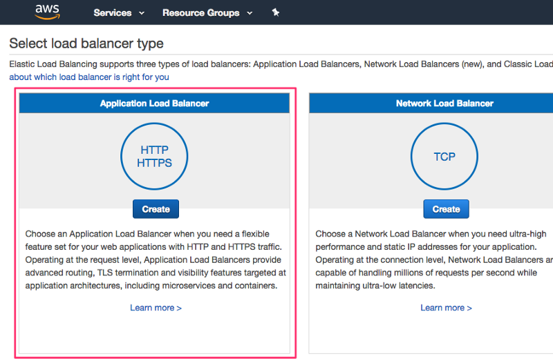

# How to deploy the docker container

## Create your docker image and upload it to the repository: 

1. Change directory into the root directory of this repository

2. Create the docker image (and optionally tag it with the name data-api): `docker build -t fern-practice .` This will create the image that we're going to upload.

3. Assuming that you have the AWS command line system installed (and have the profile set up for whichever account you want to use) we need to create the repository (the slash here is to create a repo above the basic level): `aws ecr create-repository --repository-name practice/practicefern --profile codices --region eu-west-1`

4. Now this should return a json object that looks like this:

```javascript
{
    "repository": {
        "repositoryArn": "arn:aws:ecr:eu-west-1:069818277826:repository/practice/practicefern",
        "registryId": "069818277826",
        "repositoryName": "practice/practicefern",
        "repositoryUri": "069818277826.dkr.ecr.eu-west-1.amazonaws.com/practice/practicefern",
        "createdAt": 1539864230.0
    }
}
```

The important part here is the repositoryUri here because we're going to use that to deploy.

5. Now we change the tag. We can look up the image ID by running docker images and looking for our image id there (kind of a pain) OR you can use the tag..but either way we want to change the tag on this image to match our repo- which it found in the repositoryUri above: `docker tag fern-practice 069818277826.dkr.ecr.eu-west-1.amazonaws.com/practice/practicefern`

6. Now we need to get logged in to allow us to deploy to the repository. This will require a long key that we will get from aws. To get that key we need to send a login command and then pipe it to our clipboard so (assuming that you are using a computer that has pbcopy): `aws ecr get-login --no-include-email --profile codices --region eu-west-1 | /bin/bash` 

7. Now paste the previous command onto your command line with a ctrl-v. You should get back a "Login Succeeded". This keeps you logged in for the next 12 hours.

8. Now that we're logged in let's push our image to the new uri: `docker push 069818277826.dkr.ecr.eu-west-1.amazonaws.com/practice/practicefern` This might take a while so go get a cup of coffee.

9. Now that we're pushed go into the console and verify that your image made it to the repo (keep in mind that in the above link I'm set to eu-west-1. If you didn't push to that region then switch your region in the top right of the screen)

10. Okay- so this is key- when you make a change to the docker container or code you have to re-deploy the image by completing all steps up to here. Okay, so now...

## Create your Task Definition:

11. Log into your aws account. In the **services** section type in **ecs**. This will take you to the __elastic container service__. Once there we need to create a **task definition** so:


12. Now choose **fargate**: 


13. The next screen will specify which container we want to run (including resources and ports). Select **addcontainer** and choose the container we just added to the repository (see next step on how to get the correct uri)


14. Here is the repository uri in the repository (if you need to open this up in another tab to grab it). Copy that:


15. Expose the appropriate port (3000 in my case here):


16. Create appropriate environment variables (like NODE_ENV, etc):


17. Grab a cup of coffee! YOUR TASK DEFINITION IS DONE!! NOW...we need to create a cluster to host these tasks! Basically- the TASK DEFINITION is how we will run our container and the CLUSTER will host them.

## Create a cluster:

18. Open up the __clusters__ tab in ecs and choose **create cluster**:


19. Choose **Networking only**:


20. Choose a VPC if you want it (totally up to you- but default is probably okay):


## Create and configure a Load Balancer:

21. Why do we need a Load Balancer? Simple: otherwise the public IP will change every time we redeploy our application. The dedicated load balancer will also allow us to attach a domain to our Fargate task! With all of that being said- go into your console and type "Load balancer" into services. That should take you to AWS EC2:


22. Choose "https" for your load balancer type (this means that we **are** going to need a certificate in a later step- which is a PITA- but we can get a free one from Amazon)



23. Configure the load balancer using the same vpc you used before (default or whatever) and choose at __least__ two subnets from the availability zones:


24. Now you have to choose your certificate...you can request a free one from ACM which I suggest you do:


25. And we want to configure our ports (__443__ for https and __80__ for http from **any** source if you want this to be public):


26. Ignore the next screen about defining targets. The target will be defined automatically once we deploy the task to Fargate. Finally- look at the summary page and click **Create**.

## Create the Service

27. Now we're going to create the service. Go back to AWS ECS and choose "create a service":


28. Now- in the above screen I have set the number of "tasks" to one...but that is analogous to __instances__ that we are running...so if we are expecting heavy, heavy loads we should bump this up fairly high (like 5 instances). **instances** represent, basically, the number of computers running to host our containers.

29. On the next stream click the **EDIT** button next to **Security Groups** to edit the security group. Specify the desired port of your application (3000 if you are using just a generic express.js image, or 80 for public or 443 or whatever). Click **SAVE**


30. Back at your previous screen select **Load Balancing** and select **Application Load Balancer**. Create the newly created load balancer from the drop down (assuming it's there). Click on **Add to load balancer** to apply the ports to the load balancer:


31. You need to make sure that you enter the health check path or the app won't receive any traffic. Everything else can be left as is! Hit a bunch of "Next steps" until you get to the end, Go back to the ecs "main page". You should see your app going from **PENDING** to **RUNNING** as it is built. 


32. Now we are ready to test the application. Grab the public IP from the **Task** page:


33. And now you should be able to go to your site (with the proper port- so :3000) and see if your healthcheck is working!!

## Domain Configuration:

34. So now we want to create the domain registry using AWS [Route53](https://aws.amazon.com/route53/) which will grant us our DNS registry. Head over to route 53 and choose "hosted zones":


35. In the next section you will: 
    * Create a new record set (which, in this case, is the subdomain)
    * Name the subdomain
    * Select **Alias** = **Yes**
    * Select our ALB from the drop down under the **Alias Target**


36. This should automatically hook you up to the fargate instance and we're DONE!!

This whole thing is basically 100% credit to Arik Liber at [medium](https://medium.com/@ariklevliber/aws-fargate-from-start-to-finish-for-a-nodejs-app-9a0e5fbf6361)